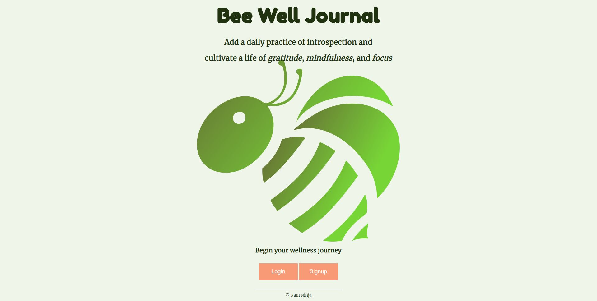
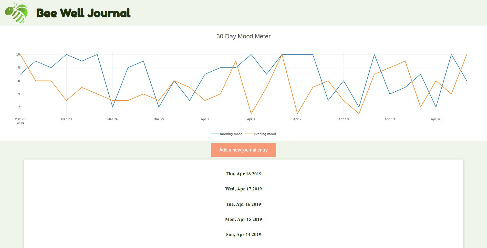
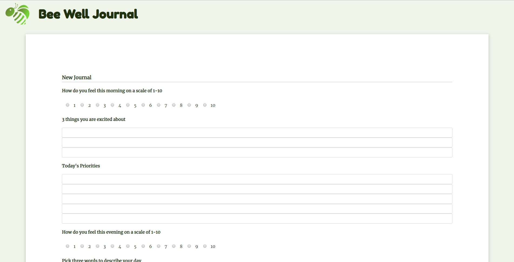
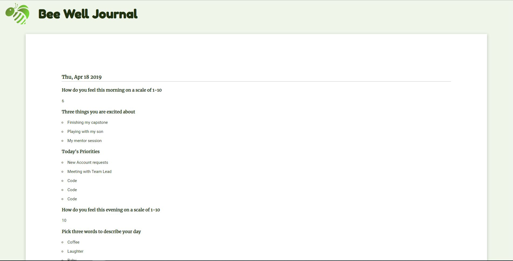

# Bee Well Journal
[https://gentle-chamber-86652.herokuapp.com](https://gentle-chamber-86652.herokuapp.com)

####Demo credentials: 
email: Demo@demo.com
password: demo

### Summary

Bee Well Journal is a journaling app inspired by daily mindfulness and gratitude practice.
The purpose of the app is to create a space for a user to reflect on their day.  It starts with 
a morning review to add focus to your day. It ends with an evening review to reflect on how the 
day went, things to improve on, and general feelings.  There is also a regular journaling section to provide more insight for users.

In addition to the Journaling, there is a mood rating system. It is a simple and honest measurement of how you are feeling on a scale of one to ten.  The visualization is there to remind users of how their mood is trending, so that they can go back to that journal and reflect what made them fel that way.

Bee Well Journal is an app that was made for myself.  Throughout my life, I have suffered from depression.  I meditate, keep a journal, use a scheduling app, keep a gratitude journal among other things. So many things in so many places. I wanted Bee Well Journal to be all of those things in one place.  There is also the added environmental benefit of saving trees by buying less journals.

### Screen shots

#### Login or Sign up

#### Once you are authenticated, your dashboard will display your morning and evening mood for the past 30 entries.  Below the Mood meter is a list of all your journals.

#### You can Add new journal entry

#### Or review an older entry or continue a morning entry

### V2.0 Goals
    -Allow users to edit passwords and emails
    -Add Word Cloud Visualization 
    -Add pagination for older entries
    -Add a 'date' input to backdate entries
   

### API Documentation

GET dashboard
    -Requires authenticaton
    -Renders the dashboard with data visual and list of descending journal entries

GET /mood-data
    -Requires authentication
    -Populates authenticated user's mood data in a serialized format
    -Contains morning rating, evening rating and creation date of journal entry (no personal info)

GET /create-journal
    -Requires authentication
    -Renders the journal entry form

GET /create-journal/:id
    -Requires authentication
    -Renders the journal entry form but populates the form with prior data
    -Used to edit journals or to continue journal for evening review

POST (PUT) /create-journal/:id
    -Requires authentication
    -Allows user to save edited journal entry
    -Journal is submitted using HTML Form method

GET /journal/:id
    -Requires authentication
    -Renders a single journal entry in cleaner format for user to review

DELETE /delete-journal/:id
    -Requires authentication
    -Deletes a single journal 

### Technology 
Node Express, EJS, Plotly, Passport, mongoDB/mongoose, Mocha/Chai for testing
#### Languages:
HTML/CSS/Javascript/JQuery

